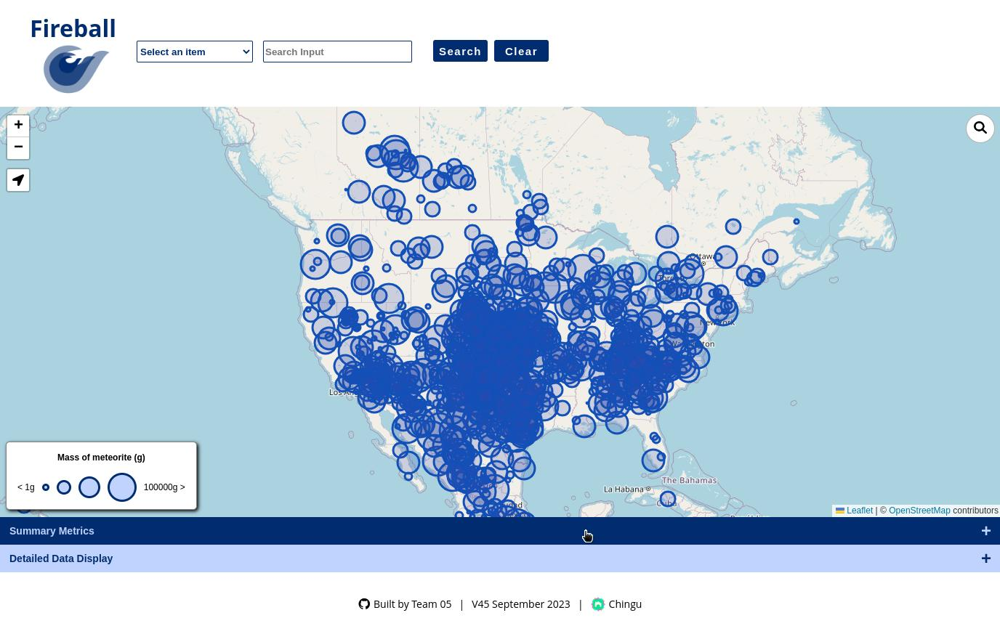

# Fireball by v45-tier1-team-05

## Table of contents

- [Overview](#overview)
  - [The challenge](#the-challenge)
  - [Screenshot](#screenshot)
  - [Links](#links)
- [Our process](#our-process)
  - [Built with](#built-with)
  - [Continued development](#continued-development)
- [Our team](#our-team)
- [Acknowledgments](#acknowledgments)

## Overview

Fireball is our app created to track meteorite strikes around the world in a fun and easy way.

### The challenge

Users should be able to:
- Use **search field** to filter meteorite strikes by name, year, mass, composition, and country
- Use a **search bar** located at the top-right of the map to filter by country (with autocomplete)
- **Geolocate** the user to view meteorite strikes near you
- View **summary statistics** including total number of strikes, average mass, and histograms by year and composition
- View **detailed data** of each strike (ie. name, year, composition, country)

For a full set of project requirements, see [here](https://github.com/chingu-voyages/voyage-project-tier1-fireball/tree/main).

### Screenshot

### Links

- Team [repo](https://github.com/chingu-voyages/v45-tier1-team-05/tree/main)
- Deployed on [Github Pages](https://chingu-voyages.github.io/v45-tier1-team-05/)

## Our process

### Built with

- HTML
- CSS
- Flexbox
- Javascript
- Leafletjs
- Open Street Maps
- Plotly

### Continued development

- Users can report bugs or submit ideas for features within this github repo

## Our team

- [Stacy](https://github.com/Stacy-Riley)
- [Jules](https://github.com/jclegg31)
- [Frosty](https://github.com/frosty8104)
- [Andie](https://github.com/namjooningOnline)
- [Louis](https://github.com/chef-louis)

## Acknowledgments

Voyage-45 | https://chingu.io/ | Twitter: https://twitter.com/ChinguCollabs
